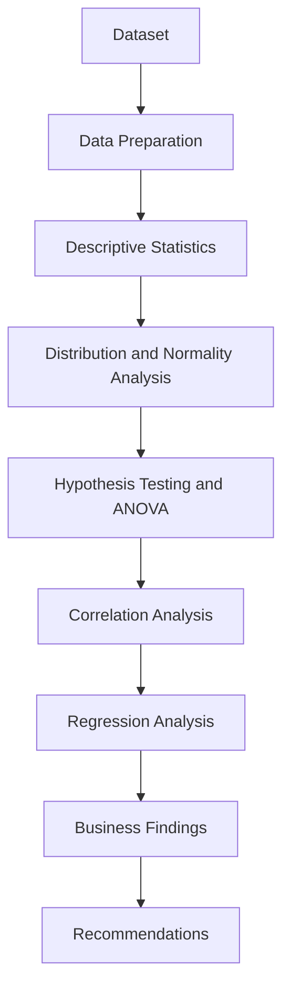

# Telecom Customer Churn Analytics

A university Business Analytics project exploring customer churn in the telecommunication service sector, with recommendations relevant to decision-making in Sri Lanka. The analysis uses R and RStudio to examine customer characteristics, compare customer groups and interpret statistical relationships.

## Project objective

Identify factors associated with the supplied churn score and use the findings to support informed customer-retention decisions. The analysis describes associations; it does not establish that changing a predictor will cause customers to stay or leave.

## Dataset overview

The dataset contains **5,000 records and seven variables**, with no missing values or duplicate rows detected.

| Variable | Description |
| --- | --- |
| `MonthlyCharges` | Monthly charges in USD |
| `DataUsageGB` | Data usage in gigabytes |
| `CallMinutes` | Call usage in minutes |
| `CustomerTenureMonths` | Customer tenure in months |
| `NumComplaints` | Complaint measure; fractional values require clarification |
| `ChurnProbability` | Supplied churn measure, analysed as an uncalibrated score |
| Customer Type | Individual, Business or VIP; imported into R as `customer.type` |

Although named `ChurnProbability`, the target ranges from 0 to 10, and 4,975 values exceed 1. It cannot be interpreted as a probability or percentage. The dataset also lacks an observed departure outcome, so the models explain the supplied score rather than validated customer churn.

## Tools used

| Tool | Role |
| --- | --- |
| R | Statistical calculations, modelling and graphics |
| RStudio | Data preparation, analysis and output inspection |
| Git | Version control |
| GitHub | Repository hosting and project documentation |

## Analytical techniques

- **Descriptive statistics and central tendency:** means, medians, empirical modes, standard deviations and observed ranges.
- **Bell curves and distribution analysis:** fitted normal reference curves, histograms and Q–Q plots.
- **Normality and hypothesis testing:** Shapiro–Wilk tests and tests of group differences and predictor associations.
- **One-way ANOVA:** Welch ANOVA as the main comparison, with conventional ANOVA and Kruskal–Wallis sensitivity checks.
- **Post-hoc comparisons:** pairwise Welch tests with Holm adjustment. Tukey HSD was not used; the variance check supported comparisons that allow unequal variances.
- **Correlation analysis:** Spearman correlations, Pearson sensitivity comparisons and a correlation heatmap.
- **Regression analysis:** separate simple regressions, multiple regression, residual diagnostics, multicollinearity checks, HC3 robust standard errors and a reproducible holdout evaluation.
- **Graphical analysis:** boxplots, scatterplots and residual and influence plots.

## Analysis workflow



## Key findings

Customer types have statistically different mean churn scores. VIP customers have the highest mean, followed by Business and Individual customers.

| Customer type | Mean churn score |
| --- | ---: |
| VIP | 6.858 |
| Business | 4.569 |
| Individual | 2.612 |

However, score thresholds reproduce every customer-type label in this dataset. The origin of those categories must be checked before treating the group differences as independent evidence for retention decisions.

- Monthly charges have a positive association with the churn score.
- Data usage and call minutes show positive associations when examined individually.
- Customer tenure has a negative association with the churn score.
- The complaint measure has a positive association with the churn score.
- When predictors are considered together, monthly charges, customer tenure and complaints remain statistically significant. Data usage and call minutes are not significant at the 5% level in the multiple regression; their strong relationships with charges limit separate interpretation.

## Business recommendations

- Review customers with high monthly charges for possible affordability or package-fit issues.
- Improve early-stage retention through onboarding and timely support.
- Respond promptly to repeated complaints and evaluate whether service recovery improves outcomes.
- Consider different retention approaches for customer types after verifying that the categories come from independent account information.
- Use analytics to design and evaluate retention pilots, with actual departures and commercial outcomes measured before wider implementation.

Validate the target definition, complaint measure and customer categories before operational use. These recommendations are proposals for testing, not demonstrated effects of interventions.

## RStudio analysis

RStudio was used for data preparation, descriptive analysis, visualisation, hypothesis testing, ANOVA, correlation and regression. The verified analysis runs with R 4.6.1 using base R functions, without additional R packages. Its holdout evaluation uses a fixed seed for reproducibility.

## Repository structure

```text
Telecom-Customer-Churn-Analytics/
└── README.md
```

This repository currently contains the project documentation only. The report, R project, script, dataset and evidence are held in the separate submission package and have not been uploaded here.

## Author

Fathima-Asna
